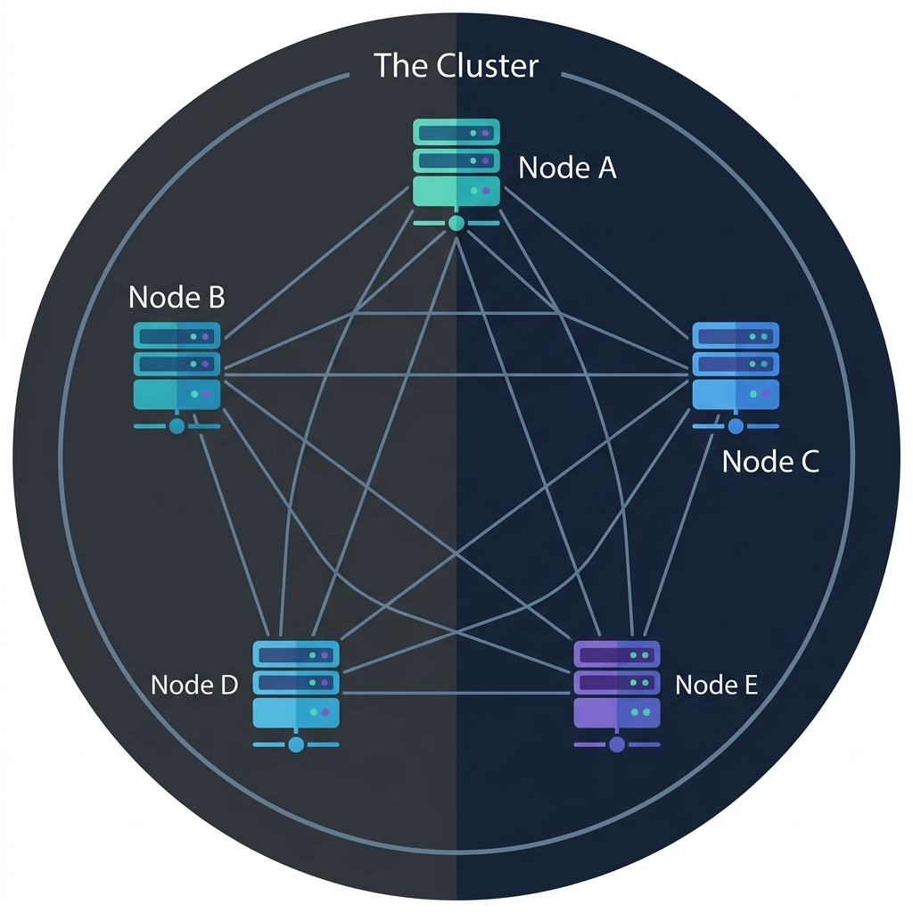
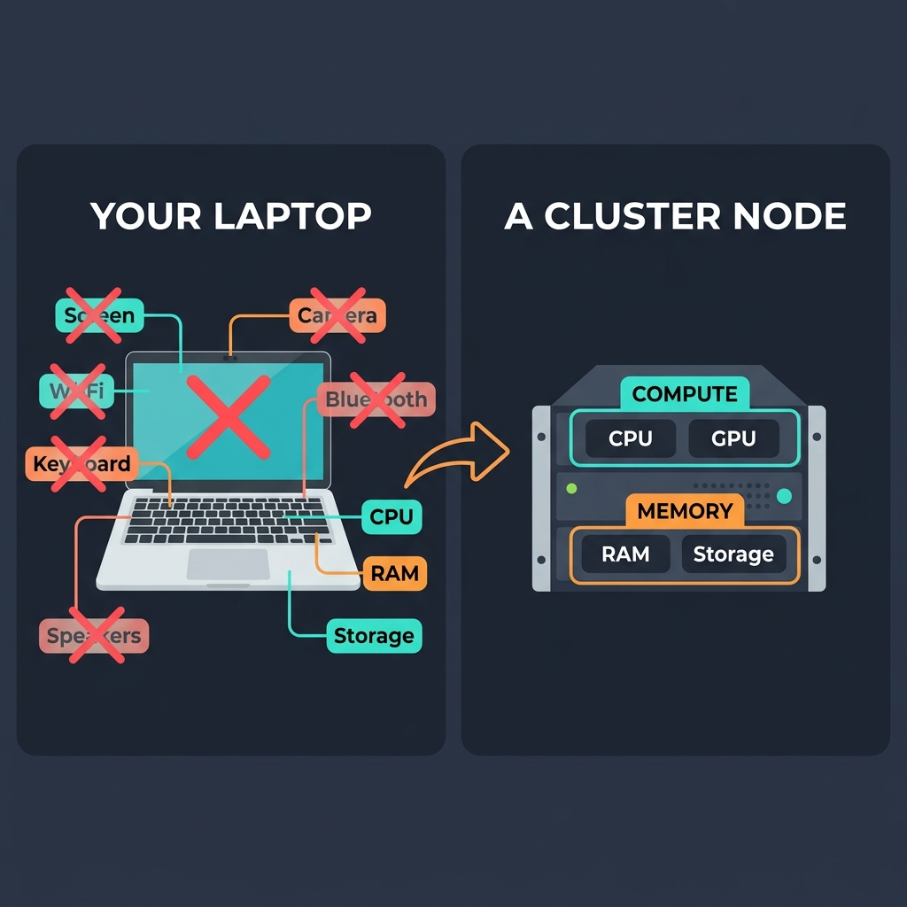
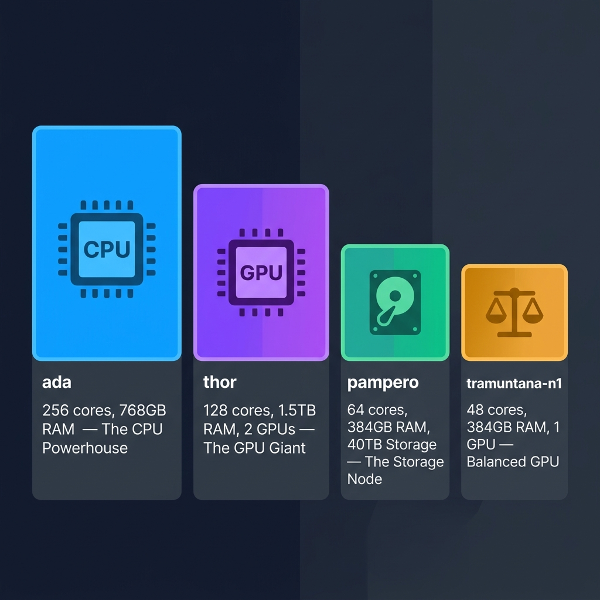

# Part 1: Under the Hood

Before you start running simulations or training models on the Tramuntana cluster, let's understand what goes on in the background. Don't worry — no prior knowledge needed. We'll start from scratch.

---

## What Does "Cluster" Even Mean?

Let's start with the English word itself. A **cluster** simply means *a group of similar things close together* : A cluster of stars, A cluster of islands 🏝️.

So when we say a **computing cluster**, we literally mean: **a group of computers**.

That's it. A cluster is just a bunch of computers connected to each other through cables (and when they are connected they are said to be in the same network). Each individual computer in this group is called a **node** — and each node is really just a regular computer, not that different from the laptop you're reading this on.

You take Computer A, Computer B, Computer C, Computer D… connect them all together so they can talk to each other, and you've got yourself a cluster.

Each box is one node (one computer), and the lines between them are the network connections that allow them to communicate. Together, they form one big cluster.

---

## Why Would You Do This?

### 1. More Power
The most obvious reason: **if you connect many computers together, you get one much more powerful computer**. Some big problems require simulation or models need more computational power than a single laptop can provide.

### 2. Specialization
Not all computations are the same. Some tasks need huge amounts of storage ( like loading a massive genomics dataset). Others need raw number-crunching power or CPUs or GPUs (like running climate simulations). A cluster can have different types of computers optimized for different types of work. One node might have a massive amount of storage, another might have powerful GPUs. You pick the right tool for the right job.

### 3. Shared Resources
A high-performance workstation for a single researcher can cost €10,000 to €30,000. Instead of every researcher at the institute buying their own expensive machine, the whole institute can share one cluster. It's way more cost-efficient, and the cluster is far more powerful than any single workstation could be.

---

## Understanding a Single Computer

Before we go deeper into how clusters work, let's take a step back and understand what a single computer is actually made of. This will help you understand *why* some cluster nodes in tramuntana are different from other.

When you open up your laptop (or look at the specs of your personal computer), it's not just one single unit. It's actually a collection of many specialized parts, each doing a specific job.

- **Screen (Display)** — Other than the big physicall screen which you see, here's a dedicated chip inside your laptop whose entire job is to handle what goes on the screen — rendering images, displaying text, showing videos.
- **Wi-Fi Chip** — A separate, specialized chip whose only job is to handle your wireless connection. It makes sure you stay connected to the network, handles the authentication (passwords and security), and makes sure nobody unwanted can sneak into your connection through wi-fi.
- **Keyboard & Trackpad** — They have their own tiny controllers that detect which key you pressed and where your finger moved.
- **Camera & Microphone** — For video calls and recording, each with its own hardware.
- **Speakers & Bluetooth** — More specialized chips for audio output and short-range wireless communication.
- **Battery** — Stores power so your laptop works without being plugged in.

And then there are the big three — the parts that do the real computational work:

- **CPU (Central Processing Unit)** — This is the brain 🧠 of your computer. When you run a Python script or an R analysis, the CPU is the part that actually *crunches the numbers*. It reads your instructions (code) and executes them, one after another, incredibly fast. Modern CPUs can do billions of calculations per second.

- **Storage (SSD or Hard Drive)** — This is where your files permanently live. Your documents, datasets, scripts, photos — they all sit on storage. When you turn your computer off and back on, everything is still there because storage is *persistent*. But storage is relatively slow to read from — think of it as a big warehouse. Lots of space, but it takes a moment to go find and grab something.

- **RAM (Random Access Memory)** — This is also memory, but it's *much faster* than storage and sits much closer to the CPU. When you open a file or run a program, the data gets loaded from storage into RAM so the CPU can work with it quickly. Think of RAM as your desk — it's small, but everything on it is within arm's reach. When you turn off your computer, RAM is wiped clean (unlike storage, it's not persistent).

   > **Quick note**: CPUs also have an even tinier, even faster memory built right into them called **cache**. It's so close to the processing part of the CPU that data can be accessed almost instantly. You'll never need to think about cache — it works automatically — but it's good to know it exists.
- **It is very important** - I cannot stress enough how important it is to understand that even though the term memory and storage can be used interchangeably in everyday language, in these docs or guids and also in general in the world of computers, **we will use memory only for RAM or caches and storage only for the storage drives ( SSD,Hard Drive etc).** In essence memory is temporary storage which is lost when the power is cut or the program ends, and storage is permanent storage which is not lost when the power is cut or the program ends. When you run a program, and that program needs some data, your computer loads a copy of the data from the storage drive to the RAM ( memory ). This is done because RAM is much faster and closer to the CPU than storage. But having said that , the basic fucntion of both the memory and storage is to store data. 

The key takeaway here: **your computer is not one monolithic thing**. It's a collection of many specialized pieces, each responsible for one specific job.

---

## Understanding a Single Computer on Tramuntana

When you use a cluster, *you* are sitting at your own laptop. You have your own screen, your own keyboard, your own Wi-Fi, your own camera. You're looking at your screen, typing on your keyboard, connected to the internet through your Wi-Fi.
Nobody sits in front of the cluster nodes. They live in a server room somewhere, quietly doing their job. So they **don't need** a lot of the things your laptop has:

- ❌ **No screen needed** — nobody is looking at them. You have your own screen.
- ❌ **No Wi-Fi chip needed** — they're connected to each other and to the network through fast cables (10 Gbps Ethernet — that's way faster than Wi-Fi anyway).
- ❌ **No keyboard or trackpad** — nobody is typing on them.
- ❌ **No camera or microphone** — nobody is video calling from a server room.
- ❌ **No speakers or Bluetooth** — no need for audio or wireless accessories.
- ❌ **No battery** — they're plugged into the wall 24/7.

So what's left? Strip away all the stuff that's only needed when a human is sitting in front of the computer, and you're left with just the essentials:

1. **Compute** — The CPU (or GPU) that crunches numbers and runs your code
2. **Memory and Storage** — Memory i.e RAM (fast, close to the CPU) and Storage (large, for files and data)

That's it!

Of course, cluster nodes do have some other parts too — power supplies, network interface cards, cooling fans, a motherboard to hold everything together. But from **your perspective as a user** — as someone who submits jobs and gets results back — you can safely think of each node as just two things: **compute + memory**. That mental model will serve you well.

Even though the pic shows both ram and storage as memory, just remember they are different. RAM is memory used by the CPU to run programs and store data temporarily. Storage is where your files permanently live like SSD or Harddrives.

---

## Not All Nodes Are Created Equal

Now, we will call that single computer in the Tramuntana cluster as a **node**. You already know that each node is basically **compute + memory + storage**. Here's the next important insight: **different nodes have different amounts of each**.

1. Some nodes have more compute power than memory or storage
These are the nodes you'd use when you need to crunch a *lot* of numbers — running large simulations, processing or modifying huge datasets, or doing heavy statistical analyses. They have many CPU cores that can all work at the same time.

2. Some nodes have more memory than compute power or storage
These are the nodes you'd use when your task needs to load very large data into memory (RAM) at once. The big machine learning models like ChatGPT or LLMs are good examples of things that need a lot of memory to run or give you a response. Even if you don't use a GPU, these nodes are still useful for CPU-based tasks that require a lot of RAM.

3. Some nodes are specialized for storage
When you need to work with enormous amounts of data on disk — reading from and writing to terabytes of files.

4. And then there are GPU nodes
Some nodes don't just have CPUs — they also have **GPUs (Graphics Processing Units)**, which are good at doing many simple calculations simultaneously. This makes them incredibly good for:
   - **Machine learning and AI** — training neural networks
   - **Certain simulations** — anything that can be broken into many small, parallel calculations

   Within the compute side, you have two flavors:
   - **CPU nodes** — general-purpose number crunching. Great for most scientific computing.
   - **GPU nodes** — specialized for massively parallel tasks. Essential for deep learning.

### Meet the Tramuntana Nodes

This is exactly how the Tramuntana cluster at IMEDEA is set up. It has 4 compute nodes, each with a different specialty:
This table may look intimidating, but don't worry about it. You'll learn which node is right for you and the technical terms explained in the later sections of this guide.
| Node | Cores (CPU ) | Memory (RAM) | Special | Best For |
|------|-------|-------------|---------|----------|
| **ada** | 256 cores | 768 GB | 7TB NVMe scratch storage | 🏋️ *The CPU Powerhouse* — when you need massive parallelism |
| **thor** | 128 cores | 1.5 TB | 2x NVIDIA RTX 6000 Ada GPUs | 🎮 *The GPU & Memory Giant* — for AI/ML and memory-hungry jobs or you need to fit big data in memory (VRAM + RAM) |
| **pampero** | 64 cores | 384 GB | 40TB local storage | 📦 *The Storage Node* — when you need lots of disk space for I/O tasks |
| **tramuntana-n1** | 48 cores | 384 GB | 1x NVIDIA L40S GPU | ⚖️ *The Balanced GPU Node* — for general GPU work |

Look at how different these are! **ada** has 256 CPU cores but no GPU — it's a pure CPU beast. **thor** has "only" 128 cores but packs 1.5 TB of RAM and 2 powerful GPUs ( remember that GPUs have their own memory, separate from the system RAM called VRAM ) — it's built for AI workloads that need both GPU power and huge memory. **pampero** has modest compute but 40TB of local storage. And **tramuntana-n1** is a well-rounded node with a single GPU.

The four nodes above are the **compute nodes** — the ones that actually crunch your numbers. Now below are the nodes which are low on compute cores but high on storage capasity these are **storage nodes** and **login nodes** (tramuntana is not a storage node, it is special and is the login node, will explain later).

| Node | Role | Key Specs | What It Does |
|------|------|-----------|-------------|
| **tramuntana** | 🚪 Login Node | 24 cores, 128GB RAM | This is the **front door** of the cluster. When you connect via SSH, you land here. It's also the SLURM controller — the brain that decides which compute node runs your job. **You should never run computations here** — it's only for logging in, writing scripts, and submitting jobs. |
| **migjorn** | 💾 Fast Storage | 47TB (RAID5) | This is where your **home directory** (`/home/username/`) lives. It's fast storage optimized for your scripts, code, conda environments, and small datasets. Each user gets a 200GB quota. |
| **tramuntana-nas** | 🗄️ Bulk Storage | 32 cores, 192GB RAM, 200TB (RAID6) | This is the **big warehouse** for shared data (`/data/`). Research groups store their large datasets here. Each group gets a 15TB shared quota. It has 32 CPU cores, but those are just for managing the storage system — not for your computations. |

So the full picture of the Tramuntana cluster is: **1 login node** (your entry point) + **4 compute nodes** (where your jobs run) + **2 storage servers** (where your files live). All connected through a fast 10 Gbps network.

So remember: **different nodes are good at different things, and you'll want to pick the right one for your task**.

---

## Recap: What You've Learned

Let's quickly recap what we covered in this part:

1. **A cluster is just a group of computers (nodes) connected together** through a network. The word "cluster" literally means "a group of similar things."

2. **Why use a cluster?** More computing power, the ability to run many jobs in parallel, specialized hardware for different tasks, shared resources for the whole institute, and your jobs keep running even when you go home.

3. **Your personal computer has many parts** — screen, keyboard, Wi-Fi, camera, CPU, RAM, storage, and more. Each part has a specific job.

4. **Cluster nodes are much simpler.** Since nobody sits in front of them, they don't need screens, keyboards, Wi-Fi, etc. From your perspective, each node is basically just **compute (CPU/GPU) + memory (RAM + storage)**.

5. **Not all nodes are the same.** Some have more CPUs, some have more memory, some have GPUs, and some have extra storage. The Tramuntana cluster has 4 nodes, each specialized for different types of work.

---

**Next up**: In [Part 2: Meet the Manager — SLURM](2-what-is-slurm.md), you'll learn about the program that sits between you and the cluster — the manager that takes your requests, assigns them to the right node, and makes sure everything runs smoothly.

---
**Navigation:**
🏠 [Home](README.md) | 📖 **1. Under the Hood** | ⚙️ [2. What is SLURM?](2-what-is-slurm.md) | 🔌 [3. Getting Connected](3-getting-connected.md) | 📁 [4. The File System](4-the-file-system.md) | 🚀 [5. Your First Job](5-how-to-slurm.md)
---
