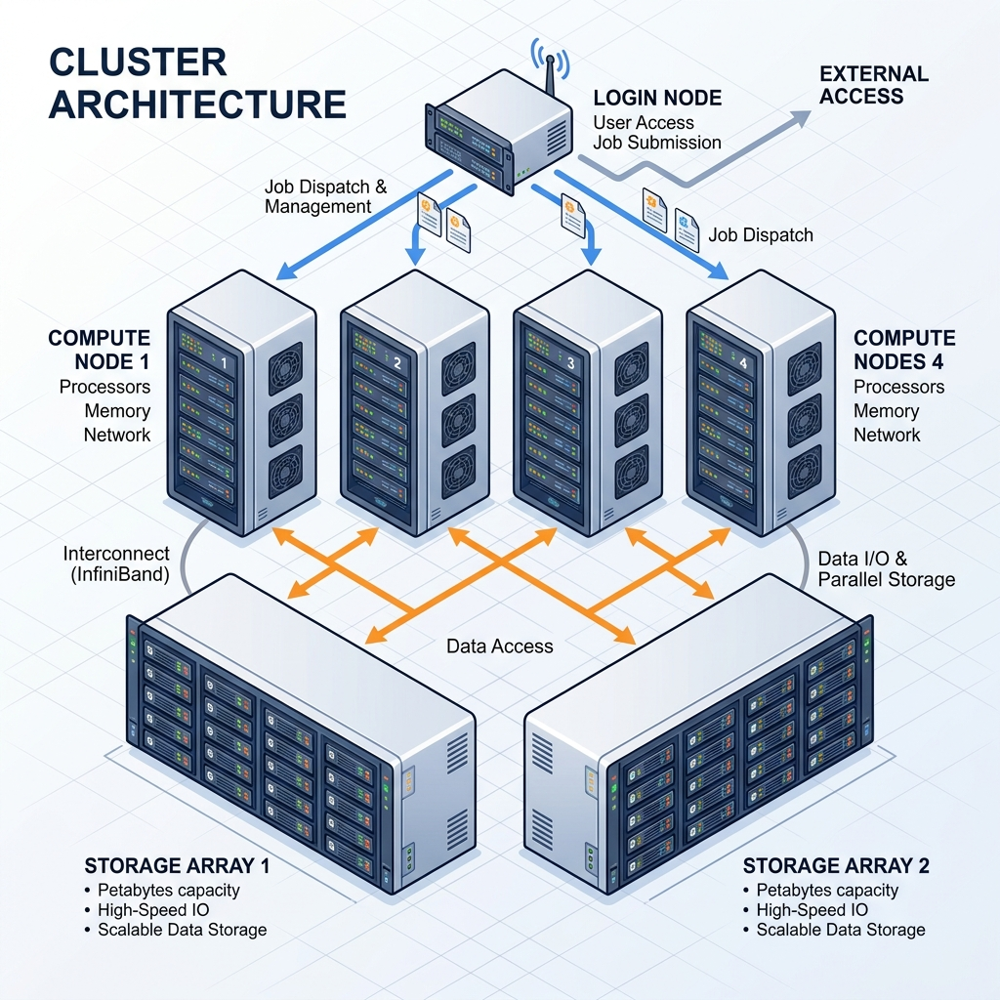

# Part 2: Meet the Manager — SLURM

Now that you understand what a cluster is, what nodes are, and what each one is good at — let's talk about how you actually *use* this thing.

Because here's the thing: you don't just walk up to a compute node and start running your Python script. There's someone standing between you and the cluster. A manager. And its name is **SLURM**.

---

## So What Exactly is SLURM?

Imagine a busy restaurant kitchen. You (the customer) don't walk into the kitchen and start cooking your own food. Instead, you talk to the **manager** — you tell them what you want, and the manager figures out which chef is available, which stove is free, and gets your order started. If the kitchen is full, the manager puts your order in a queue and gets to it as soon as possible. When your food is done, it comes back to you.

**SLURM** is that manager for the cluster. It stands for **Simple Linux Utility for Resource Management** — but you can just think of it as *the manager*.

Here's what happens when you want to run something on the cluster:

1. **You submit a request** — "Hey SLURM, I need 8 CPU cores and 32 GB of memory to run my Python script for about 4 hours."
2. **SLURM checks what's available** — It looks at all the compute nodes, sees which ones have free CPUs, free memory, and enough time slots.
3. **SLURM assigns your job** — If there's space, it picks a node and runs your program there. If everything is busy, it puts your job in a **queue** and waits until something opens up.
4. **Your job runs** — Your script runs on the compute node, doing its thing. You can go get coffee, go home, or even sleep. It keeps running.
5. **SLURM cleans up** — When your job finishes (or if it crashes), SLURM frees up those resources so someone else can use them.

That's it. SLURM is just a program that's constantly running, watching over the cluster, and making sure everyone gets a fair share of the resources. It's the middleman between you and the raw computing power.

---

## But SLURM Does More Than Just Assign Jobs

SLURM isn't just a passive dispatcher. It's also an **enforcer**. It has rules, and it makes sure everyone follows them:

- **Queuing** — If all the nodes are busy, your job doesn't get rejected. It goes into a queue and waits its turn. First come, first served (mostly — some jobs get priority, more on that in a second).

- **Fair sharing** — You can't hog the entire cluster. There's a limit: each user can have at most **20 jobs running at the same time**, and at most **50 jobs total** in the queue. This makes sure one person doesn't block everyone else.

- **Resource enforcement** — If you told SLURM "I need 32 GB of memory" and your program tries to use 64 GB? SLURM will **kill your job**. Same if you said "I need 4 hours" and your job is still running after 4 hours — SLURM terminates it. You have to be honest about what you need.

- **Priority** — Not all jobs are equal. SLURM has different **partitions** (think of them as different queues or lanes, but don't worry, we will explain this later in the guide in detail ), and some have higher priority than others. A quick 30-minute test job gets priority over a 5-day simulation.

Think of it this way: SLURM is a manager, but it's also a **bouncer**. It lets you in, but it also kicks you out if you break the rules.

---

## Where Does SLURM Live? The Login Node

So SLURM is a program that manages the cluster. But every program has to run on *some* computer, right? So which computer runs SLURM?

The answer: **the login node**.

Remember from [Part 1](1-under-the-hood.md) that the Tramuntana cluster has different types of nodes — compute nodes (ada, thor, pampero, tramuntana-n1), storage nodes (migjorn, tramuntana-nas), and one special node called simply **tramuntana**? That special node is the **login node**, and *this* is where SLURM lives.

Here's how the whole flow works in practice:

1. **From your own laptop or desktop**, you connect to the login node — a computer called **tramuntana**. (The way you connect is through something called **SSH**, which is basically a way to remotely access another computer from yours. Don't worry about the details — we'll walk through it step by step in [Part 3](3-getting-connected.md).)

2. **Once you're on the login node**, you're inside the cluster ( but only on one node of the cluster, the login node ). From here, you tell SLURM what you need — submit your jobs, check on running jobs, and look at your results.

3. **SLURM takes it from there** — it assigns your work to the right compute node and manages everything for you.

So think of it as: **Your computer → Login node → Cluster**. You never interact with the compute nodes directly. You just talk to the login node, and SLURM handles the rest.

But here's the critical rule — and I really can't stress this enough:

> ⚠️ **NEVER run computations on the login node.** The login node is not for running your experiments, simulations, or training your models. It's only for managing and launching your work. It only has 2 CPUs. All the heavy lifting happens on the compute nodes (ada, thor, pampero, tramuntana-n1), and SLURM is the one who sends your work there. It only has very limited umber of CPUs (2 CPUs) which are only sufficient for running SLURM, sending your jobs to the Compute node and handling your activity while you are on that node (tramuntana) (your activities include bash commands etc).

Think of it like the reception desk at a factory. You walk in, check in at reception, tell them what you need built — and then the factory workers (compute nodes) do the actual work. You wouldn't start welding metal at the reception desk, right? Same idea.

### ⚡ tramuntana vs tramuntana-n1 — Don't Mix Them Up!

This is a common source of confusion, so let's be crystal clear:

| | **tramuntana** | **tramuntana-n1** |
|---|---|---|
| **What is it?** | The login node | A compute node |
| **What runs here?** | SLURM (the manager) | Your jobs |
| **Can I run computations here?** | ❌ **No!** | ✅ Yes (via SLURM) |
| **Specs** | 24 cores, 128 GB RAM | 48 cores, 384 GB RAM, NVIDIA L40S GPU |

**tramuntana** = the front door, the manager's office.
**tramuntana-n1** = one of the workers on the factory floor. It happens to have a GPU, making it great for AI/ML work.

---

## The Big Picture — How It All Fits Together

Let's zoom out and see the full picture of how you actually interact with the Tramuntana cluster. Combining what you learned in Part 1 (the hardware) with what you just learned here (the manager):

That's the whole system! You connect to the login node, SLURM takes your requests and sends them to the right compute node, and your files live on the storage servers. Everything (the login node tramuntana, compute nodes (ada, thor, pampero, tramuntana-n1), and storage nodes (migjorn, tramuntana-nas)) is inter-connected through a fast 10 Gbps network. 

---

## Understanding Partitions

Before you go ahead, you need to know about **partitions**. Think of them like different lanes on a highway. A cluster has many compute nodes, and partitions are just a way of grouping them and setting rules — like speed limits and which cars (jobs) are allowed on which lane.

SLURM uses partitions to decide *where* your job can run, *how long* it can run, and *what priority* it gets. If you don't specify a partition, your job goes to the default lane (`cpu`).

Tramuntana has **three partitions**:

| Partition | Which Nodes Can It Use? | Max Time | Priority | Best For |
|-----------|-------------------------|----------|----------|----------|
| **express** | All 4 compute nodes (ada, thor, pampero, tramuntana-n1) | 2 hours | ⚡ Highest (200) | Quick tests, debugging, compiling code |
| **cpu** *(default)* | All 4 compute nodes | 10 days | Normal (50) | Long CPU-intensive jobs, R analyses, simulations |
| **gpu** | Only tramuntana-n1 & thor (the ones with GPUs) | 10 days | High (100) | AI/ML training, GPU-accelerated computing |

**How to pick one:**
- Need a quick 30-minute test? Use `--partition=express`. It gets higher priority so you won't wait long.
- Running a big simulation overnight? Use `--partition=cpu` (or just don't specify — it's the default).
- Training a neural network on a GPU? Use `--partition=gpu`.

**Per-user limits:** Each user can have at most **20 jobs running at the same time** and **50 jobs total in the queue**. This makes sure nobody hogs all the resources.

## Recap: What You've Learned

Let's quickly recap what we covered in this part:

1. **SLURM is the manager of the cluster.** It stands for Simple Linux Utility for Resource Management. Whenever you want to run something on the cluster, you ask SLURM, and it handles the rest — checking what's free, assigning your job to a node, and cleaning up when it's done.

2. **SLURM also enforces the rules.** It queues your jobs when the cluster is busy, kills jobs that exceed their requested resources (time or memory), and makes sure no single user hogs everything.

3. **SLURM runs on the login node (`tramuntana`)**, which is the computer you connect to via SSH. The login node is your launchpad — you use it to submit and manage jobs, but **never** to run computations.

4. **Don't confuse `tramuntana` (login node) with `tramuntana-n1` (compute node).** They are completely different machines with very different purposes.

5. **Partitions are like different lanes on a highway**. A cluster has many compute nodes, and partitions are just a way of grouping them and setting rules — like speed limits and which cars (jobs) are allowed on which lane.

---

**Next up**: In [Part 3: Getting Connected](3-getting-connected.md), you'll learn how to actually connect to the cluster for the first time — setting up the VPN, logging in via SSH, and landing on the login node.

---
**Navigation:**
🏠 [Home](README.md) | 📖 [1. Under the Hood](1-under-the-hood.md) | ⚙️ **2. What is SLURM?** | 🔌 [3. Getting Connected](3-getting-connected.md) | 📁 [4. The File System](4-the-file-system.md)
---
