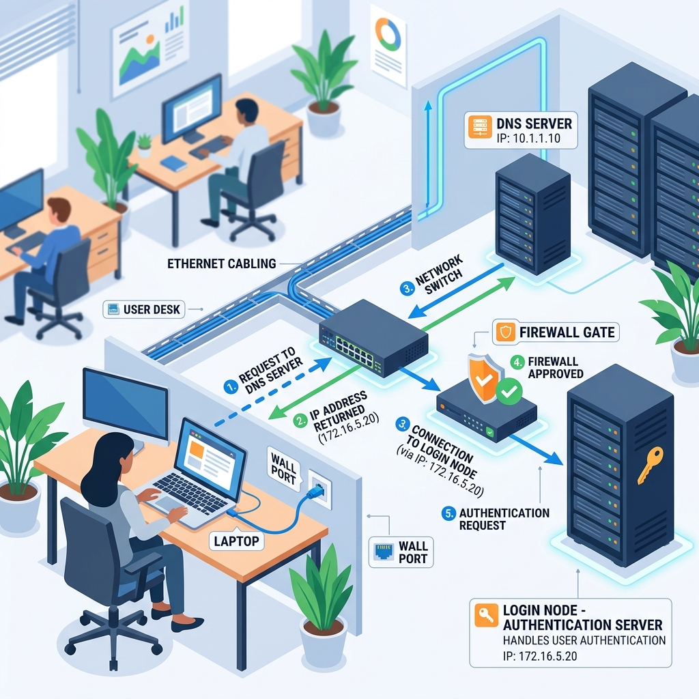
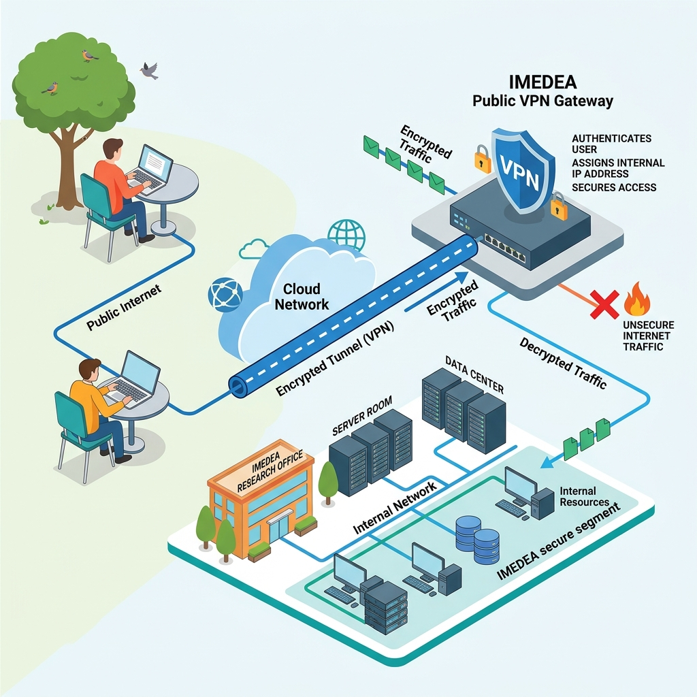

# Part 3: Getting Connected

You know what a cluster is. You know SLURM is the manager who takes your requests and assigns them to the right compute node. Now it's time to actually **get in** — to connect to the cluster and land on that login node we've been talking about.

But before we jump into typing commands, let's understand *what's actually happening* when you connect. Because if you don't know what's going on under the hood, those commands will just feel like magic spells you memorize without understanding. And we don't want that.

---

## Every Computer Has an Address

Let's start with something simple: **every computer connected to a network has an address**. Just like every house on a street has a house number, every computer has a number that identifies it. This number is called an **IP address** (Internet Protocol address).

Your laptop has one. Your phone has one. The login node of the Tramuntana cluster has one too — its address is **`10.33.0.143`**.

An IP address looks something like this: `10.33.0.143` or `192.168.1.45` — just a bunch of numbers separated by dots. Not exactly memorable, right? You wouldn't want to have to remember the IP address of every computer you need to talk to. That would be like memorizing the phone numbers of every person you know instead of just looking up their name in your contacts.


---

## The Address Book — DNS

And that's exactly why we have an **address book** for computers. It's called **DNS** — Domain Name System — but you can just think of it as a phonebook or a dictionary.

DNS is a mapping. It takes a human-friendly name and gives you back the actual IP address (the number). Just like how your phone's contact list maps "Mom" → +34 612 345 678, DNS maps computer names to their IP addresses:

| Name (what you type) | IP Address (where it actually goes) |
|---|---|
| `tramuntana` | `10.33.0.143` |
| `google.com` | `142.250.185.14` |
| `github.com` | `140.82.121.4` |

So when you type `tramuntana` somewhere, the system goes to this "phonebook," looks up the name, finds `10.33.0.143`, and uses that number to reach the right computer. You never have to remember the number yourself — you just use the name.

This address book (DNS server) is a computer itself, sitting somewhere in the network, and every computer on the network knows where to find it. When you connect your computer to a network, one of the first things that happens is your computer is told: "Hey, if you need to look up any names, ask *this* computer" — and that computer is the DNS server.
Imagine you go and live in a new city ( network ), where each house has a unique house number ( IP address ). And when you get registered in the city town hall ( join the network ) the city town hall gives you the address of a house which is the help center ( DNS server ). You can go here whenever you need help with finding the address of any other resident. Like hey where does mr. Tramuntana live in IMEDEA city? And the help center tells you mr. Tramuntana lives at this house number - 10.33.0.143.


---

## The Office Network — Connected by Cables

Now, let's talk about how computers actually talk to each other. Let's start with the simplest case: **you're sitting at your desk in the office at IMEDEA**.

Look behind your desktop computer. See that yellow cable plugged into the back? That's an **Ethernet cable**. It goes from your computer into the wall, and from there it goes to a **network switch** — a box that connects all the cables from all the desktops in the office together. And that same switch is also connected to the cluster's login node (`tramuntana`).

So right now, sitting in your office, your desktop computer and the login node are connected by **physical wires**. This connection of all the PCs to the login node through physical wires is what they mean when they say - "They're ( computers ) on the same network". This enables them to be able to talk to tramuntana.

All these cables — from your desktop, from your colleague's desktop, from the servers in the server room — they all come together and form a **network**. And because this network is only for IMEDEA (not for the general public), it's a **private network**. Not just anyone can get in. You have to be physically plugged in or connected through a VPN using credentials to access this network. So we can call it a **Physical Private Network.**


---

## Logging In From the Office — What SSH Actually Does

Okay, so you're sitting at your desk. You're plugged into the network. Now you want to connect to the login node and start working on the cluster. You open a terminal and type:

```bash
ssh your-username@tramuntana
```

This is the **SSH command** — SSH stands for **Secure Shell**, and it's basically a way to remotely sit in front of another computer. You're saying: *"I want to open a terminal on that other computer and control it from here."*

But let's break down what actually happens when you press Enter on that command. It's like sending a letter:

### Step 1: Looking Up the Address

First, your computer sees the name `tramuntana` in the command. It doesn't know what to do with a name — computers work with numbers. So it goes to the **address book (DNS)** and asks: *"What's the IP address for 'tramuntana'?"*

The DNS server responds: *"That's `10.33.0.143`."*

Now your computer knows *where* to send the request.

### Step 2: Sending the Request Through the Cable

Your computer packages up your request — *"I want to connect, and my username is `your-username`"* — and sends it through that yellow Ethernet cable. The request travels through the switch and arrives at `10.33.0.143`, which is the login node.

Here's an important detail: just like when you send a physical letter, you don't just write the recipient's address — you also write your own **return address** on the envelope. Your computer does the same thing automatically. Every message it sends includes its own IP address — the IP address of your desktop computer. You don't type it anywhere; it just gets added automatically by the network. This is how the login node knows *where* the request came from.

### Step 3: The Network Checks the Gate

Now, the IMEDEA network has a kind of gate — a **firewall** ( Or **DHCP Server IP assigment**, but dont worry it is doing the same function and this much detail is not needed ). Before the request even reaches the login node, the network checks: *"Is this request coming from inside our private network?"*

Since you're sitting at your office desk, physically connected through that Ethernet cable, your computer has an IP address that's part of the IMEDEA network range ( This simply means that the IMEDEA network admin added your computer's IP address to the list of safe IPs which are allowed to access the login node ). The gate sees this and says: *"Yep, this address is one of ours. Let it through."*

This is the "private" part of the private network. If someone from the outside (not connected to the IMEDEA network) tried to send a request to `10.33.0.143`, the gate would say: *"I don't know you. Blocked."*

### Step 4: The Login Node Asks Who You Are

The request arrives at the login node. But the login node doesn't just let anyone in who can reach it. It asks: *"Okay, you got through the gate, but **who are you**?"*

This is where your **username** comes in — the one you typed in the command (`your-username@tramuntana`). The login node sees your username and says: *"I know this user. But prove it — what's your password?"*

It sednds this question "Prove it that you are who you say you are" back to you through the same cable because it knows the return address you left on the envelope. You type in your password (your **IMEDEA LDAP credentials**, which the system administrator gave you), and the login node checks it against its records.

### Step 5: You're In!

The password matches. The login node says: *"Welcome!"* And now you have a terminal session running on the login node — the same login node where SLURM lives. From here, you can submit jobs, and manage your work on the cluster.

All of this happens in a fraction of a second. You type the command, enter your password, and you're in. But now you know what's actually going on behind the scenes.



---

## But What If You're Not in the Office?

Everything we just described works perfectly when you're sitting in the office, physically connected with that Ethernet cable. But what about when you're at home? Or at a café? Or traveling?

You don't have that yellow cable at home. There's no wire going from your laptop to the IMEDEA network. So how does your request reach the login node?

The short answer: **it can't** — not directly. Remember that gate (the firewall)? It only lets in requests from IP addresses that are part of the IMEDEA network. Your home Wi-Fi gives you a completely different IP address — one that the IMEDEA network doesn't recognize. If you tried to SSH from home without doing anything special, the gate would say: *"Never seen this address. Blocked."*

So you need a way to make your laptop *appear* as if it's on the IMEDEA network, even though it's physically somewhere else. And that's exactly what a **VPN** does.

---

## The VPN — A Virtual Cable

**VPN** stands for **Virtual Private Network**. Let's break that down, because the name actually tells you everything:

- **Private Network** — Remember that network of yellow cables in the office? The one where all the desktops and servers are connected together, and only those devices can access each other? That's a private network. It's private because not everyone can get in — only devices physically connected to it.

- **Virtual** — Now imagine you could take one of those yellow Ethernet cables, stretch it alllll the way from the IMEDEA server room to your apartment, and plug it into your laptop. You'd be on the private network, just like being in the office. Obviously, you can't actually run a cable across the city. But you can create a **virtual** version of that cable — one that runs over the **public internet**, instead of through a physical wire.

That's what a VPN is. It creates a secure, encrypted tunnel through the public internet between your laptop and the IMEDEA network ( since you and IMEDEA both have access to the puclic internet, you can use the internet to connect to the IMEDEA network ). 
   - When you connect to the VPN you have to authenticste yourself to the VPN using the UIB credentials. Once you connect to the VPN your laptop gets assigned an IP address that's part of the IMEDEA network ( because you proved your identity through the credentials you entered in the VPN, that you are part of IMEDEA ) — as if you just plugged in that yellow cable in IMEDEA. The gate ( Firewall ) sees your requests coming from a recognized address within IMEDEA and lets them through. This is equivalent to the process described in **Step 3: The Network Checks the Gate** in the previous section.

Think of it this way:
- **In the office**: You → yellow cable → IMEDEA network → login node ✅
- **At home (no VPN)**: You → Wi-Fi → public internet → IMEDEA gate says "no" ❌
- **At home (with VPN)**: You → Wi-Fi → public internet → **VPN tunnel** → IMEDEA gate says "yes"  ✅ → IMEDEA network → login node ✅

The VPN takes your internet connection and wraps it in a virtual version of that office cable using your UIB credentials to prove your identity to the gate.



---

## Logging In From Home — SSH Over VPN

So here's what you do when you're at home (or anywhere outside IMEDEA):

1. **First**, you connect to the VPN. This puts your laptop on the IMEDEA private network.
2. **Then**, you SSH into the login node, just like before.

But there's one small difference. Remember that **address book (DNS)** — the phonebook that maps `tramuntana` → `10.33.0.143`? That address book lives on a DNS server inside the physical IMEDEA network. When you're in the office, your computer knows to ask that specific DNS server. But when you're at home, connected through your Wi-Fi, your computer uses your home internet's DNS server — and that server has no idea what `tramuntana` means. It's not in its phonebook.

So instead of typing the *name*, you type the actual *number* — the IP address directly:

```bash
# From home (on VPN) — use the IP address
ssh your-username@10.33.0.143
```

Compare this with what you type in the office:

```bash
# From the office — the name works because DNS knows it
ssh your-username@tramuntana
```

| Where you are | VPN needed? | SSH command |
|---|---|---|
| 🏢 **In the office** | No — you're already on the network | `ssh your-username@tramuntana` |
| 🏠 **At home / anywhere else** | Yes — connect to VPN first | `ssh your-username@10.33.0.143` |

That's really the only difference. Once you're connected (whether from office or home), the experience is exactly the same — you land on the login node, SLURM is there waiting, and you're ready to work.


---

## The Actual Steps — Let's Do It

Enough theory! Here's exactly what you need to do, step by step.

### Step 1: Install the VPN Client (One-Time Setup)
1. Go to [https://www.eduvpn.org/client-apps/](https://www.eduvpn.org/client-apps/)
2. Download the eduVPN client for your operating system:
   - **macOS**: Download the macOS version
   - **Windows**: Download the Windows version
   - **Linux**: Follow the instructions for your distribution
   - **Mobile**: Apps are available for iOS and Android too (handy if you need quick access)
3. Install the application

### Step 2: Connect to the VPN

1. Open the eduVPN application
2. Set up the connection (first time only):
   - Enter the server address: **`https://eduvpn.uib.es`**
   - Or search for **"Universidad de las Islas Baleares"** in the app's search bar
3. Your browser will open for authentication — log in with your **UIB Digital credentials**
   
   > ⚠️ **Note**: These are your **UIB credentials** (the ones you use for UIB services), *not* the cluster password. We'll use a different password for SSH in the next step.

4. Grant access to the eduVPN application when prompted
5. Click **Connect** in the eduVPN client
6. Make sure you see the connection is active before proceeding

**More info**: [UIB VPN documentation](https://tic.uib.cat/Servei/Cataleg_serveis/Xarxa-privada-virtual-VPN/)

### Step 3: Open a Terminal

Now you need a **terminal** — the text-based window where you type commands.

- **macOS**: Open **Terminal** (search for it in Spotlight, or find it in Applications → Utilities)
- **Linux**: Open your terminal application (usually `Ctrl + Alt + T`)


### Step 4: Connect via SSH

Now type the SSH command. Which one depends on where you are:

**From the office (no VPN needed):**
```bash
ssh your-username@tramuntana
```

**From home or anywhere outside IMEDEA (VPN must be connected):**
```bash
ssh your-username@10.33.0.143
```

Replace `your-username` with your actual IMEDEA username (the one the system administrator gave you).


### Step 5: First-Time Login — The Scary Message

The very first time you connect, you'll see a message that looks something like this:

```
The authenticity of host 'tramuntana (10.33.0.143)' can't be established.
ED25519 key fingerprint is SHA256:xxxxxxxxxxxxxxxxxxxxxxxxxxx.
Are you sure you want to continue connecting (yes/no/[fingerprint])?
```

Don't panic! This is perfectly normal. Your computer is saying: *"Hey, I've never talked to this computer before. I don't have it in my contacts yet. Are you sure this is the right one?"*

Type **`yes`** and press Enter.

This message will only appear the first time. After that, your computer remembers the login node and won't ask again.

> **What's happening behind the scenes?** Your computer is saving the login node's unique fingerprint (like a digital ID card). Next time you connect, your computer checks that the fingerprint matches — to make sure you're talking to the real login node and not an imposter. It's a security feature.

### Step 6: Enter Your Password

After the host key is accepted (or on subsequent logins), you'll see:

```
your-username@10.33.0.143's password:
```

Type your **IMEDEA LDAP password** — this is the password that the system administrator provided to you. 

> ⚠️ **Important**: When you type your password, **nothing will appear on screen** — no dots, no asterisks, nothing. This is normal! It's a security feature in the terminal. Just type your password and press Enter.

> **Remember**: This is your **IMEDEA password** (LDAP), *not* the UIB password you used for the VPN. Two different systems, two different passwords.

### Step 7: You're In! 🎉

If everything went well, you'll see something like this:

```
Welcome to Ubuntu 24.04 LTS (GNU/Linux ...)

Last login: Mon May 10 14:23:01 2026 from 10.33.0.XX

your-username@tramuntana:~$
```

That `your-username@tramuntana:~$` at the bottom is the **command prompt** — it tells you that you are now logged in as `your-username` on the computer called `tramuntana`. This is the login node. You're inside the cluster.

From here, you can start submitting jobs to SLURM, checking the cluster status, and doing your work.

Try typing this to see the cluster status:

```bash
sinfo
```

This will show you all the compute nodes and whether they're busy or available — you're talking to SLURM now!

---

## Recap: What You've Learned

Let's quickly recap what we covered in this part:

1. **Every computer on a network has an IP address** — a number like `10.33.0.143` that uniquely identifies it. The login node's IP is `10.33.0.143`.

2. **DNS is the address book** that maps human-friendly names (like `tramuntana`) to IP addresses. So you don't have to remember the numbers.

3. **In the office, you're connected by physical cables (Ethernet)** to the IMEDEA private network. Your computer, your colleagues' computers, and the login node are all on this same network.

4. **SSH is how you remotely access another computer.** When you type `ssh your-username@tramuntana`, you're sending a request through the network to open a terminal session on the login node.

5. **The network has a gate (firewall)** that only allows requests from devices inside the IMEDEA network. Your request includes your IP address automatically (like a return address on a letter), and the gate checks if it recognizes it.

6. **A VPN is a virtual cable.** When you're at home, you don't have a physical cable to the IMEDEA network. The VPN creates a secure tunnel through the internet, giving your laptop an IP address inside the network — as if you plugged in that yellow cable.

7. **From home, use the IP address instead of the name** — the DNS that maps `tramuntana` to `10.33.0.143` lives inside the physical network and isn't available through your home Wi-Fi.

8. **Two different passwords**: UIB Digital credentials for the VPN, IMEDEA LDAP credentials for SSH. Don't mix them up!

---

**Next up**: In [Part 4: The File System](4-the-file-system.md), you'll learn where your files actually live on the cluster — home directories, shared group storage, quotas, and how the storage nodes we mentioned in Part 1 fit into the picture.

---
**Navigation:**
🏠 [Home](README.md) | 📖 [1. Under the Hood](1-under-the-hood.md) | ⚙️ [2. What is SLURM?](2-what-is-slurm.md) | 🔌 **3. Getting Connected** | 📁 [4. The File System](4-the-file-system.md)
---
