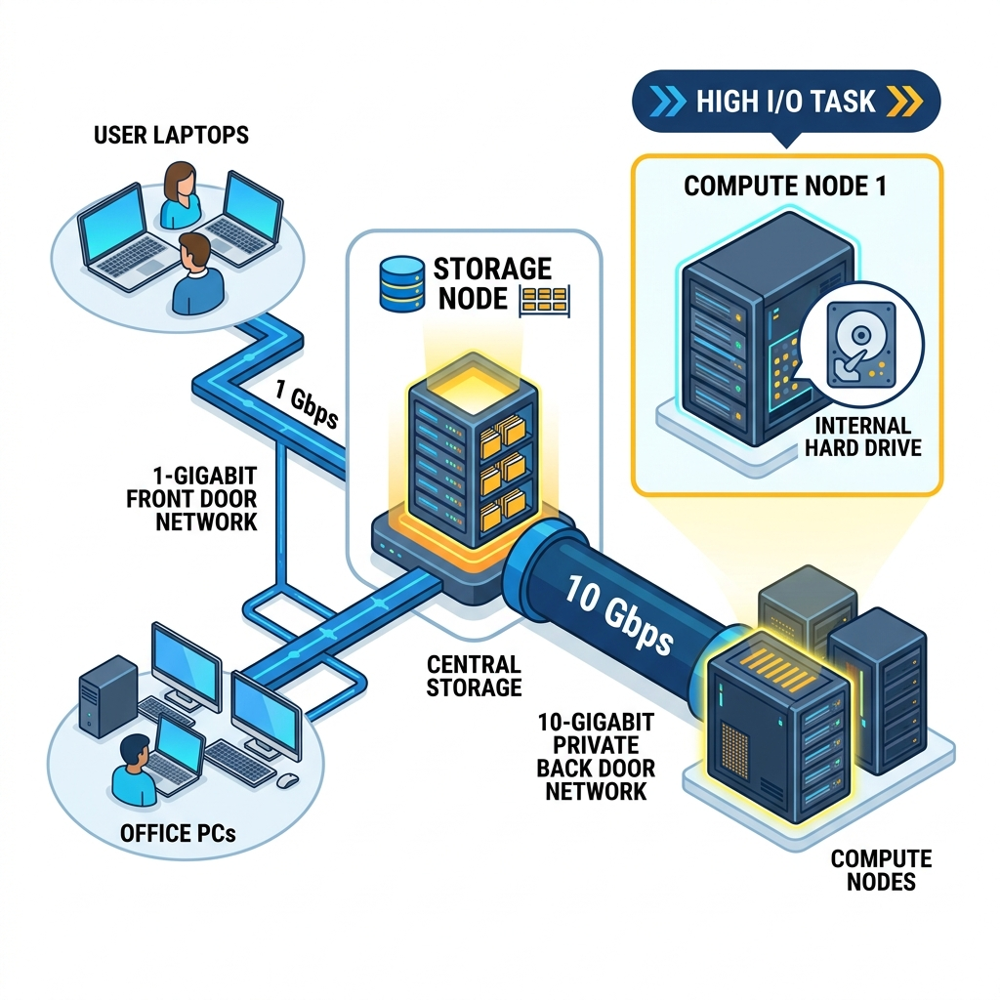

# Part 4: The File System

You're logged in! You are now sitting on the login node (`tramuntana`). 

If you type `ls /` (which means "list everything in the root folder"), you will see two very important folders: **`home`** and **`data`**.

But here is the trick: **neither of these folders actually lives on the login node.** 

To really understand how to work effectively on a cluster, you need to know how the storage works. If you skip this part and just start running jobs, you might accidentally make your computations incredibly slow without realizing why. 

---

## 1. The Magic Folders: Home and Data

When you go inside the `/home` directory, you'll see folders with the usernames of all the people using this cluster. You'll have your own folder in there (`/home/your-username`). This is your personal space. It has a specific size limit (quota) assigned to you, typically 200GB.

If you work in a big research group, the data you need for your computations is probably much bigger than 200GB. That's what the `/data` folder is for. It is the massive shared warehouse for your group's large datasets.

But as I told you, these folders aren't really on the login node. They actually live on **completely different nodes** — the storage nodes we met in [Part 1](1-under-the-hood.md):
- **`/home`** is actually coming from the storage node **`migjorn`** (which has 47TB of fast storage).
- **`/data`** is coming from the massive storage node **`tramuntana-nas`** (which has 200TB of bulk storage).

So if these folders live on other computers, how can you see them right here on the login node? And more importantly, how do the compute nodes (like `ada` or `thor`) see them when they need to run your jobs?

---

## 2. Behind the Scenes: Making the Folders Available

To make these folders available everywhere, the system administrators use a few special configurations. 

To get the different machines talking and sharing folders, there are three specific files doing all the heavy lifting:

1. **The Address Book:** This tells the non-storage node or computer ( like login node or ada or pampero or thor ) the addresses of all the storage nodes. It says, "Hey, `migjorn` lives at this specific IP address," so they don't get lost trying to find the storage.
2. **The Permission Slip:** This file lives on the "Boss" node sharing the data ( the storage node, like `migjorn` or `tramuntana-nas` ). It tells the storage node, "These are the specific nodes ( like login node or ada or pampero or thor ) you are allowed to share your files with." It's a security guard checking the guest list.
3. **The Portal:** This file again lives on the non-storage nodes (like the login node or the compute nodes like ada or pampero or thor ). It tells them to automatically "tunnel" (connect) into the storage node's storage every time they boot up ( when it boots up it checks the adress book and connects to the storage nodes ). 

Because of this setup, the folder from the storage node is **mounted** onto your current node. Your node thinks as if the folders are its own. But when you open the `/home` folder on your login node, you are actually looking directly at the hard drives over on `migjorn`. In real time the files are transferred to you and you read or see them. And each time you want to see them the data ha to be fetched again ( if it is not in the memory or RAM ). So its not file sync its data streaming.

*Remember* here mounting means over-riding i.e. the storage node's data folder will override any folder which already exists locally with the same name and if it doesn't exist it will just create a new folder of that name.

---

## 3. The Cable Problem

Now you know that your files live on storage nodes, but your computations happen on compute nodes (like `ada` or `thor`). 

This brings us to a crucial point: **Every time a compute node needs to read or write a file in `/home` or `/data`, that data has to physically travel through a cable.**

Imagine you submit a job to run on `ada`. Your data is sitting in `/home` (which is physically on `migjorn`). Every single time the CPU on `ada` needs a piece of that data, it has to ask `migjorn` for it, the data travels through the cable, arrives at `ada`, gets processed, and if the result needs to be saved, it travels all the way back through the cable to `migjorn`.

If your program reads a file once, does math for an hour, and writes one result file, this is totally fine. But what if your program reads and writes thousands of tiny files every second? 

This is called an **I/O heavy task** (Input/Output heavy. Here reading is input and writing is output). If you do this over the network cable, your job will be incredibly slow, because traveling through the cable takes time. It can also slow down the network for everyone else on the cluster!

---

## 4. The Two Networks (1G Front Door vs 10G Back Door)

The good news is that the cables connecting the compute nodes to the storage nodes are incredibly fast. But to understand how this works, we need to slow down for a second and talk about how computers actually connect to each other.

In the networking world, computers plug into big physical boxes called **switches**. You can think of a switch as a giant, multi-plug extension cord, but for data. If two computers are plugged into the same switch, they can talk to each other.

The Tramuntana cluster actually uses two completely separate switches, creating two separate networks. But here is the key: **the nodes (the computers in the cluster) are plugged into *both* of these switches at the same time.**

1. **The 1-Gigabit Front Door (`10.33.x.x`):** 
   Imagine the first switch as the public front door. This switch physically connects our cluster to the rest of the university and, ultimately, the internet. When you are sitting on the office Wi-Fi, or using the VPN from home, you are using this network to connect to the login node. **All the nodes are connected to this 1-Gigabit switch**, so they can all talk to the outside world if they need to. It's perfectly fine for typing commands and sending small files.

2. **The 10-Gigabit Private Back Door (`192.168.0.x`):** 
   Now, imagine a second, much faster switch hidden in the back room. This switch does *not* connect to the internet or the university. It is a private, high-speed network designed *exclusively* for the nodes to talk with *themselves*. 
   
   Why do we need this? Because when a compute node like `ada` asks the storage node `migjorn` for massive amounts of data, we don't want that data clogging up the "front door" network where people are trying to work or watch videos. Instead, the data travels over this massive 10-Gigabit private pipe. 

Because the nodes are plugged into *both* switches, they act as a bridge. They have a standard 1-Gigabit front door for users for getting small basic things to the cluster like internet etc, and a blazing-fast 10-Gigabit back door just for heavy cluster data traffic between nodes.

---

## 5. Where Should I Put My Data?

Because of how this all works, there are two main ways to handle data when you run jobs, depending on what your job does:

### The "Universal Boss" Strategy (For Normal Jobs)
This is the default setup we just described. There is a Single Source of Truth (the storage nodes). It is made sure that the storage node overrides the `/data` and `/home` paths on every single compute node. 

The beauty of this is that you can write a script on the login node, send it to `ada`, and send it to `thor`, and you **never have to change the file paths**. `/data/my-project` looks exactly the same on every single machine because they are all looking through the portal at the same Boss machine. 

Files are streamed in real-time from the Boss machine when requested. This ensures the entire cluster is looking at the exact same set of files.

### The "Local Storage" Strategy (🚧 Work in Progress)
If your job is reading and writing gigabytes of data constantly (I/O heavy), streaming it over the cable—even the fast 10G cable—is a bad idea. 

Instead, it makes much more sense to keep that data physically on the **same computational node** where your job is running. Remember in Part 1 how `ada` has 7TB of NVMe scratch storage and `pampero` has 40TB of local storage? That's what it's for! 

**However, please note that this local storage strategy is not completely implemented right now, so please do not try to use it just yet.** 

Here is how it will work in the near future:
We are planning to take the data folders from these compute nodes and "mount" them directly onto the login node itself. This means you won't need to actually SSH into the compute nodes to put your data there; you'll be able to transfer your data straight from the login node!

We will also partition the compute node's local storage into two parts:
1. **User Data:** One part for you to safely save your data for your tasks.
2. **Internal Buffer:** Another part for the internal buffer of the compute node itself. (Don't worry about what an internal buffer is—it's complicated plumbing and you don't need to know about it!)

So, for now, just know that trying to use this local storage method won't work while we are still implementing it. Stick to the "Universal Boss" strategy!

---

## Recap: What You've Learned

1. **Your files aren't on the login node.** `/home` and `/data` actually live on massive storage servers (`migjorn` and `tramuntana-nas`).
2. **The Portal:** The `/etc/hosts`, `/etc/exports`, and `/etc/fstab` files work together to securely "mount" the storage folders onto all the other nodes, making them appear local.
3. **The Data Cable Problem:** Accessing shared storage from a compute node means data has to travel over a cable. 
4. **Two Networks:** The cluster has a 1-Gigabit front door for users, and a massive 10-Gigabit private back door just for the nodes to talk to each other without being slowed down by university traffic.
5. **Universal Boss vs Local Storage:** For most jobs, reading from the shared storage (the Boss) is perfect. For I/O heavy jobs, it's better to copy the data to the compute node's local hard drive first so it doesn't have to travel through the cables constantly.

---

**Next up**: In [Part 5: Your First Job](5-how-to-slurm.md), we'll finally put everything together and you'll write and submit your very first batch job to the cluster using SLURM.

---
**Navigation:**
🏠 [Home](README.md) | 📖 [1. Under the Hood](1-under-the-hood.md) | ⚙️ [2. What is SLURM?](2-what-is-slurm.md) | 🔌 [3. Getting Connected](3-getting-connected.md) | 📁 **4. The File System** | 🚀 [5. Your First Job](5-how-to-slurm.md)
---
